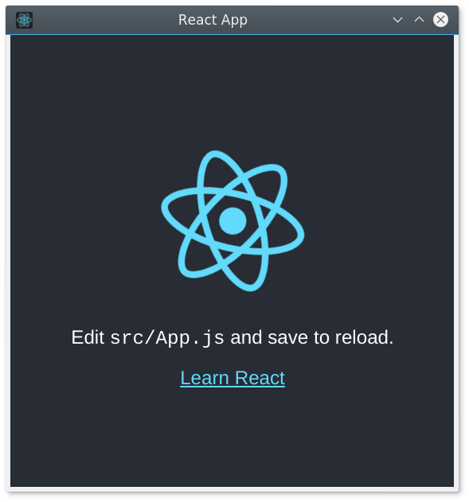
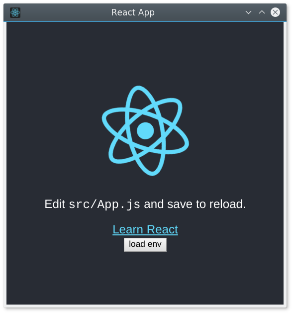

# carlo-cra

Add [carlo](https://github.com/GoogleChromeLabs/carlo) capabilities to any react app built with [Create React App](https://github.com/facebook/create-react-app).

- Add OS capabilities to your react app using Node.
- Bundle your react app into a single executable. (Thanks to [pkg](https://github.com/zeit/pkg))

## Getting started

Install carlo-cra

```
yarn add carlo-cra
#npm i carlo-cra
```

Edit your `package.json` start script to run your app inside carlo instead of your system browser:

```diff
   "scripts": {
-    "start": "react-scripts start",
+    "start": "BROWSER=./node_modules/carlo-cra/start.js react-scripts start",
     "build": "react-scripts build",
+    "bundle": "carlo-cra-bundle",
```

Run `yarn start` and you'll see your react app running inside carlo:


### Add Node capabilities to your app

Create a file in `carlo/index.js`, and export the functions you want to expose from node to your react app:

```js
const backend = {
  sum(a, b) {
    // this sum runs in the node process
    return a + b;
  },

  getEnv() {
    // access to OS info
    return process.env;
  }
};

module.exports = backend;
```

To access to `backend` from your react components, `carlo-cra` gives you a `BackendContext`. To use it, include the provider in your app:

```diff
+import Backend from "carlo-cra/backend-context";

-ReactDOM.render(<App />, document.getElementById('root'));
+ReactDOM.render(
+  <Backend.Provider>
+    <App />
+  </Backend.Provider>,
+  document.getElementById("root")
+);
```

And use it in your components:

```diff
+import BackendContext from "carlo-cra/backend-context";

 class App extends Component {
+  state = { env: null };
   render() {
+    const { env } = this.state;
     return (
       <div className="App">
         <header className="App-header">
@@ -19,6 +22,21 @@ class App extends Component {
           >
             Learn React
           </a>
+          <BackendContext.Consumer>
+            {backend => (
+              <div>
+                <button
+                  onClick={async () => {
+                    const env = await backend.getEnv();
+                    this.setState({ env });
+                  }}
+                >
+                  load env
+                </button>
+                {env && <pre>{JSON.stringify(env, null, 2)}</pre>}
+              </div>
+            )}
+          </BackendContext.Consumer>
         </header>
       </div>
     );
```

Or with react hooks:

```js
const [env, setEnv] = useState(null);
const backend = useContext(BackendContext);
useEffect(() => {
  backend.getEnv().then(env => {
    setEnv(env);
  });
}, []);
```

You can even create a custom `useEnv` hook ;)


### Bundle your app into a single executable file

```
yarn build
yarn bundle
```

This will generate an executable file with the name of your app:

```
./react-app
```

## Config

By default `carlo-cra` will look for your node backend in `carlo/index.js` file, but you can configure this in your `package.json`:

```json
"carlo-cra": {
    "index": "carlo/index.js",
    "srcDir": "carlo"
},
```

`index` is the file that carlo-cra will expose to your client app.

`srcDir` is the directory where the backend code is. `carlo-cra` will watch file changes in this dir to reload the dev environment. We recommend `index` file to be inside `srcDir` folder.
